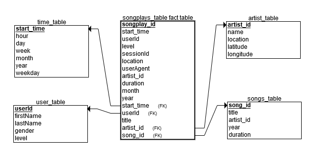

# Project: Data Lake
In this project we will build an ETL pipeline for a data lake hosted on S3.  We will load the data from S3, process the data into analytics tables using spark, and then load them back into S3.

## Technologies
- Python version 3.6.3
- AWS emr-5.20.0 cluster
    - Applications: Spark: Spark 2.4.0 on Hadoop 2.8.5 YARN with Ganglia 3.7.2 and Zeppelin 0.8.0
    - Instance type: m5.xlarge
    - Number of instances: 4 (You may use less or more)

## Data Sets
The data will reside in S3, links will be below.

#### Song Data
The first dataset is a subset of real data from the Million Song Dataset(http://millionsongdataset.com/). Each file is in JSON format and contains metadata about a song and the artist of that song.
- Link: s3://udacity-dend/song_data

#### Log Data
The second dataset consists of log files in JSON format generated by this event simulator(https://github.com/Interana/eventsim) based on the songs in the dataset above. These simulate app activity logs from an imaginary music streaming app based on configuration settings.
- Link: s3://udacity-dend/log_data

## Tables
The song and log data above will be used to create the tables below on our data lake.

#### Fact Table
- songplays - records in log data associated with song plays i.e. records with page NextSong
    - songplay_id, start_time, user_id, level, song_id, artist_id, session_id, location, user_agent
    - year and month will be included for partitioning when writing the files
    
#### Dimension Tables

- users - users in the app
    - user_id, first_name, last_name, gender, level
- songs - songs in music database
    - song_id, title, artist_id, year, duration
    - year will be included for partitioning when writing the files
- artists - artists in music database
    - artist_id, name, location, latitude, longitude
- time - timestamps of records in songplays broken down into specific units
    - start_time, hour, day, week, month, year, weekday
    

## Usage
I strongly suggest using a spark EMR cluster similar to what is noted in `Technologies`.

1. Terminal Method
- Input AWS key and secret key into `dl.cfg` 
- Run `etl.py` in terminal 
    - python etl.py
2. EMR cluster method
- Create an AWS EMR cluster similar to what it noted in `Technologies`
- Move `etl-emr.py` into the EMR cluster
- Run `etl-emr.py` on your EMR cluster
    - /user/bin/spark-submit --master yarn etl-emr.py

## Files

- data: Contains a small portion of the song and log data zipped for testing
- unzip_data: Contains the unzipped data from the `data` file
- dl.cfg: Config file that contains AWS key and secret key
- etl.ipynb: Goes through the ETL testing process used to create `etl.py`
- pyspark.ipynb:  Jupyter notebook used for testing functionality of etl.ipynb in a pyspark notebook attached to an EMR cluster
- etl.py: ETL program to be run that loads data, transforms, and writes data to S3
    - `etl.py` requires AWS key and secret key in `dl.cfg`
- etl-emr.py: ETL program specific to AWS EMR cluster. It removes the need for configparser and your AWS key/secret key when running on an EMR cluster.
    - `etl-emr.py` does not require AWS key and secret key if it is run on your EMR cluster

###### Author

Ryan Mezera